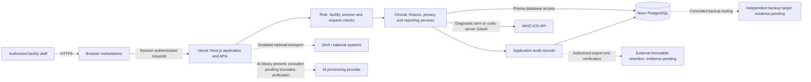
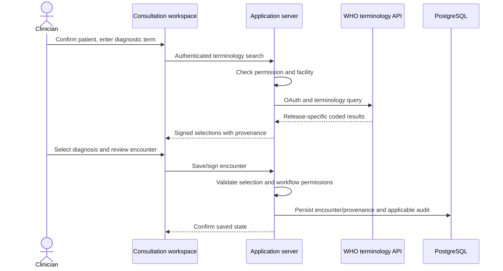

# Architecture and data flows

Describes the committed release; provider region, physical residency, contractual access and encryption configuration require documentary verification. No diagram is proof of those controls.

## Components and trust boundaries

- Staff devices/browser: clinical information is displayed to authenticated users; shared-device handling and local downloads require facility policy.
- Application boundary: Next.js 16.3.3 / React 19.2.8 on Vercel. Server endpoints enforce access; hiding UI controls is insufficient. Production credentials stay server-side.
- Persistence boundary: Prisma 6.12.0 with PostgreSQL on Neon stores clinical and operational records. Schema and migration inventory are version-bound in the manifest. Provider account access is a separate control from application roles.
- External service boundary: WHO receives the entered search query; no patient-record exchange is implied. AI libraries are present, but no operational AI claim is made. National transmission remains outside the proposal.
- Operations boundary: releases, database migrations, backups, audit exports and privileged provider administration require separate evidence and accountable custody. A retained Neon branch shares the provider boundary.

## Data-flow inventory

| Flow | Data and purpose | Destination/custody | Evidence still needed |
|---|---|---|---|
| Browser → application | Credentials, session requests, selected patient and care/billing input | Vercel application | Device policy, transport/configuration evidence, security assessment |
| Application → database | Identity, clinical records, finance, permissions, audit and governance | Neon PostgreSQL | Region/residency, processor terms, encryption, key and administrative access evidence |
| Application → WHO | Entered diagnosis term/code and server OAuth credentials | WHO ICD API | Approved terminology use, query-handling notice and clinical walkthrough; users must not enter patient identifiers |
| Patient rights export | Authorized patient's exported information | Authorized staff then approved recipient channel | Identity verification, custody, secure delivery and retention procedure |
| Backup | Database contents, potentially all patient data | Independent encrypted target to be evidenced | Target, keys, schedule, off-provider custody, measured restore |
| Audit export | Auditable activity records and integrity information | Approved immutable external target to be evidenced | Access policy, retention period, verification receipts |
| Support/telemetry | Necessary operational metadata | Application/provider tooling | Logging inventory, redaction review and access/retention evidence; do not assume no PHI leakage without review |
| AI, if later included | Selected clinical context can still be health data even without direct identifiers | Provider/project to be approved | Separate DPIA/terms/residency/retention, boundary review and clinical evaluation |
| National exchange, if later included | Approved profile-specific patient/report payloads | Authorized national endpoints | Contracts, credentials, profiles, consent/provenance, retry/idempotency and acknowledgement tests |

## Deployment and recovery

Application build and database migration are separate controlled steps. The released migration inventory has 43 entries; the local paused MFA migration is not part of it. Verify the exact health commit/migration pair before associating results with a deployment. A health response demonstrates a bounded connection/version check, not readiness approval.

The retained `pre-unified-release-20260922` Neon branch is a recovery point only. Restore drills must target a disposable database, measure approved recovery objectives, verify record integrity and preserve evidence. No restore against production is authorized by this document.
